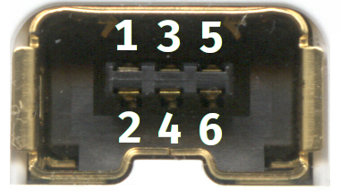

# PicoGuitar
Small project to interface a Wii Guitar Hero controller to a PC using a Raspberry Pi Pico.

## Disclaimer
The code in this repository and the guide below are provided without any warranties, so if something goes wrong and you break your guitar, that's entirely on you.

## Hardware required
- Raspberry Pi Pico
- Classic controller or Nunchuck extension cable (will be cut!)
- Continuity tester (multimeter or an LED + battery)
- Soldering iron

## Wiring
Only 4 wires need to be connected from the Pico to the guitar:
- 3.3V power
- Ground
- I2C Data (SDA)
- I2C Clock (SCL)

Cut the extension cable near the female connector end, leaving a good amount of cable to work with, then strip all the wires and use the continuity tester to map which pin on the connector goes to which wire.
Having the wires mapped, solder/connect the wires to the Raspberry Pi Pico like this:

|Female connector|   |Raspberry Pi Pico|
|:--------------:|:-:|:---------------:|
|Pin 1 (3.3V)    |-> |3.3V pin         |
|Pin 2 (SCL)     |-> |GP7 pin          |
|Pin 5 (SDA)     |-> |GP6 pin          |
|Pin 6 (ground)  |-> |Any GND pin      |

_[image source](https://en.wikipedia.org/wiki/File:Conectores_nunchuk_wiimote.png) - CC BY-SA 3.0_

## Software
- Install Arduino IDE
- Tools > Board > Board Manager > Install support for the RPi Pico: "Arduino Mbed OS RP2040 Boards"
- Tools > Manage Libraries > Install the library "WiiChuck"
- Go to https://gitlab.com/realrobots/PicoGamepad and download the entire repo as a zip file (button to the left of "Clone")
- Sketch > Include Library > Add .ZIP Library > Select the file downloaded in the previous step
- Write the sketch included in this repo to the RPi Pico.

## Comments
At the top of the sketch, you will find some constants for the whammy bar and for both axis of the analog stick. In my guitar these are the minimum and maximum values returned by WiiChuck, but I don't know if these are the same across all guitars, or if mine is just returning weird values. There is an example sketch included with the WiiChuck library which you can use to determine these values for yours.
